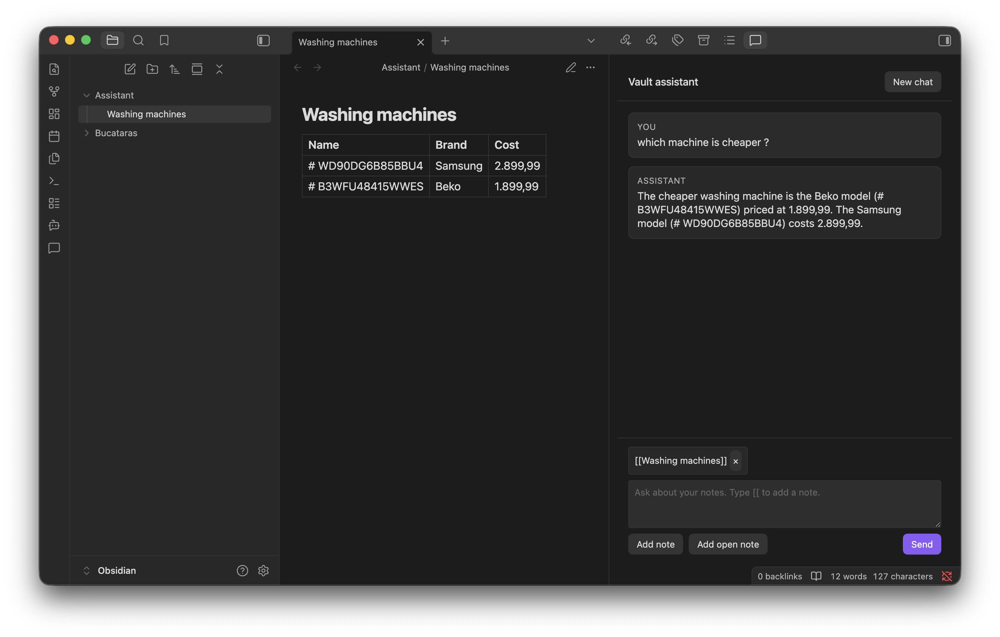

# Vault Assistant

Chat with an OpenAI-compatible model about your Obsidian vault. Search stays on your device. Notes are only sent when you chat, and only the pieces needed to answer. Creating or updating a note always waits for **Apply**.

Requires Obsidian 1.13.0+.

## Features

- Sidebar chat with markdown replies and `[[wikilinks]]`
- Bring your own key: OpenAI, OpenRouter, or Ollama (localhost or a custom URL)
- Local note search (no cloud indexing, no embeddings)
- Pin notes with **Add note**, **Add open note**, or `[[wikilinks]]` on desktop
- Propose new or updated notes in chat; nothing is written until you apply it

## Getting started

1. Install **Vault Assistant** from **Settings → Community plugins**, or copy a release’s `main.js`, `manifest.json`, and `styles.css` into `.obsidian/plugins/vault-assistant/`.
2. Enable the plugin, then open **Settings → Vault Assistant**.
3. Read the privacy notice and turn on **I understand what is sent to the provider**.
4. Choose a provider and model:

| Provider | Default endpoint | API key |
| --- | --- | --- |
| OpenAI | `https://api.openai.com/v1` | Required |
| OpenRouter | `https://openrouter.ai/api/v1` | Required |
| Ollama | `http://localhost:11434/v1` | Not required locally |

5. For Ollama, keep `http://localhost:11434` or enter a custom `http(s)` host. Do not put credentials in the URL.
6. Optionally **Detect models** and **Test connection**.
7. Open chat from the ribbon or the command **Open chat**.

Ollama must expose `/v1/chat/completions`. Models that cannot use tools still answer from locally retrieved note chunks.

## Using chat

- Ask a question. Matching notes are retrieved locally and sent with your prompt when search is enabled.
- **Add note** picks any markdown note. **Add open note** uses notes already open in tabs. On desktop, type `[[` to insert a wikilink. Open notes are never attached unless you add them.
- Referenced notes take priority over search results (up to 10).
- When the assistant wants to create or update a note, review the card and select **Apply** or **Dismiss**. **Open note** is available after you apply.

## Commands

- **Open chat** — open the sidebar chat
- **Add open note** — pin an open markdown tab as context
- **Rebuild search index** — rebuild the local search index

## Mobile

- Enter inserts a newline. Use **Send** to submit.
- Use **Add note** and **Add open note**. The `[[` picker does not open on a phone, so the keyboard stays focused.
- `localhost` Ollama is usually unreachable from a phone. Set a reachable URL, or use OpenAI / OpenRouter.

## Privacy

- **On this device:** API keys in the plugin `data.json`, and the search index in `search-index.json`. Keys are never logged.
- **Indexing** lists markdown note paths in the vault (`getMarkdownFiles`) so search can run locally. It does not send notes anywhere. Use **Exclude folders** to skip paths.
- **Chat** sends your prompt, retrieved chunks, conversation history, notes you explicitly reference, and any note the assistant reads. The whole vault is not uploaded.
- There is no telemetry. Network calls happen only when you chat, detect models, or test the connection, and only to the provider you chose (OpenAI, OpenRouter, or your Ollama URL).
- Use Ollama on localhost if you do not want notes to leave the machine.

See [CHANGELOG.md](./CHANGELOG.md) for release history.

Developers: see [DEVELOPMENT.md](./DEVELOPMENT.md).
